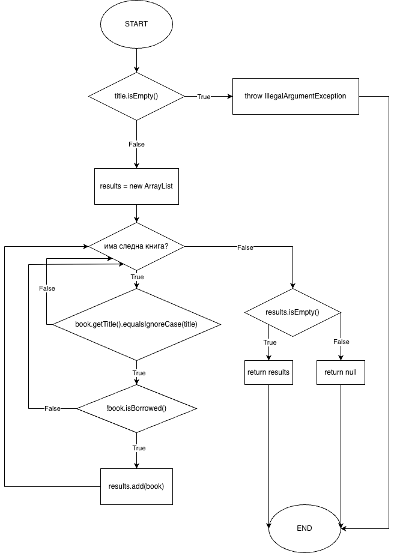
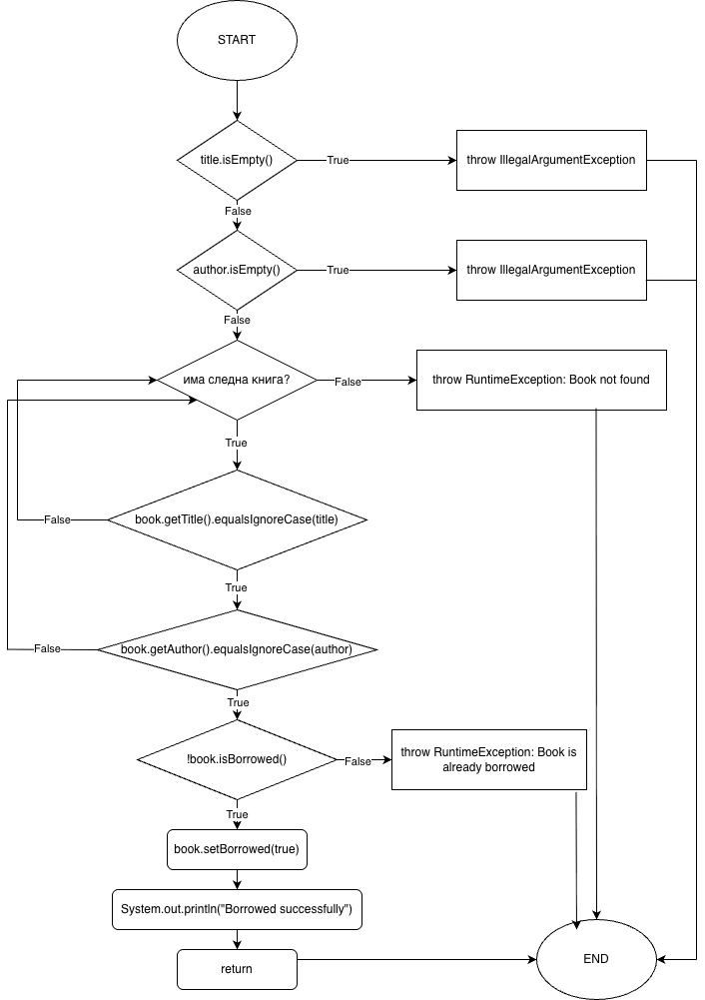

# SI_2026_lab2_233033

Име и презиме: Ангела Сибиновска  
Број на индекс: 233033  

## 2. Control Flow Graph

### Control Flow Graph за `searchBookByTitle`

### Control Flow Graph за `borrowBook`

## 3. Цикломатска комплексност

Цикломатската комплексност ја пресметувам со формулата:

V(G) = P + 1

каде што P е бројот на предикатни јазли, односно услови/одлуки во Control Flow Graph.

### Цикломатска комплексност за `searchBookByTitle`

Во функцијата `searchBookByTitle` ги имаме следните предикатни јазли:

1. `title.isEmpty()`
2. `for (Book book : books)`
3. `book.getTitle().equalsIgnoreCase(title)`
4. `!book.isBorrowed()`
5. `results.isEmpty()`

Затоа:

V(G) = P + 1  
V(G) = 5 + 1  
V(G) = 6

Цикломатската комплексност за функцијата `searchBookByTitle` е **6**.

### Цикломатска комплексност за `borrowBook`

Во функцијата `borrowBook` ги имаме следните предикатни јазли:

1. `title.isEmpty()`
2. `author.isEmpty()`
3. `for (Book book : books)`
4. `book.getTitle().equalsIgnoreCase(title)`
5. `book.getAuthor().equalsIgnoreCase(author)`
6. `!book.isBorrowed()`

Затоа:

V(G) = P + 1  
V(G) = 6 + 1  
V(G) = 7

Цикломатската комплексност за функцијата `borrowBook` е **7**.

## 5. Every Statement критериум за `searchBookByTitle`

За Every Statement критериумот потребно е секоја наредба во функцијата `searchBookByTitle` да биде извршена барем еднаш.

Тестовите се напишани во функцијата:

`searchBookEveryStatementTest`

### Тест случаи

| Тест случај | Влез | Очекуван резултат | Покриени делови од кодот |
|---|---|---|---|
| 1 | `searchBookByTitle("")` | `IllegalArgumentException` | Проверка `title.isEmpty()` и фрлање исклучок |
| 2 | `searchBookByTitle("Clean Code")` | Се враќа листа со една непозајмена книга | Креирање листа `results`, for циклус, if услов, `results.add(book)`, `return results` |
| 3 | `searchBookByTitle("Harry Potter")` | `null` | for циклус без додавање резултати, `results.isEmpty()`, `return null` |

Минималниот број на тест случаи за Every Statement критериумот за `searchBookByTitle` е **3**.

## 7. Every Branch критериум за `borrowBook`

За Every Branch критериумот потребно е секоја гранка од секој услов да биде извршена барем еднаш.

Тестовите се напишани во функцијата:

`borrowBookEveryBranchTest`

### Тест случаи

| Тест случај | Влез | Очекуван резултат | Покриени гранки |
|---|---|---|---|
| 1 | `borrowBook("", "Robert C. Martin")` | `IllegalArgumentException` | `title.isEmpty() == true` |
| 2 | `borrowBook("Clean Code", "")` | `IllegalArgumentException` | `title.isEmpty() == false`, `author.isEmpty() == true` |
| 3 | `borrowBook("Clean Code", "Robert C. Martin")` | Успешно позајмување | Пронајдена книга, `!book.isBorrowed() == true` |
| 4 | Повторно позајмување на истата книга | `RuntimeException: Book is already borrowed.` | Пронајдена книга, `!book.isBorrowed() == false` |
| 5 | `borrowBook("1984", "George Orwell")` | `RuntimeException: Book not found` | Нема книга со дадениот наслов |
| 6 | `borrowBook("Clean Code", "Robert C. Martin")`, но книгата има друг автор | `RuntimeException: Book not found` | Насловот се совпаѓа, но авторот не се совпаѓа |

Минималниот број на тест случаи за Every Branch критериумот за `borrowBook` е **5**, но во тестот се користат **6** случаи за појасно покривање на гранките.

## 9. Multiple Condition критериум

Multiple Condition критериумот бара да се тестираат сите можни комбинации на подусловите во сложените услови.

### Multiple Condition за `borrowBook`

Условот е:

`if (title.isEmpty() || author.isEmpty())`

Подуслови:

A = `title.isEmpty()`  
B = `author.isEmpty()`

| Тест случај | title | author | A | B | Резултат |
|---|---|---|---|---|---|
| 1 | `""` | `"Author"` | true | false | Exception |
| 2 | `"Title"` | `""` | false | true | Exception |
| 3 | `""` | `""` | true | true | Exception |
| 4 | `"Clean Code"` | `"Robert C. Martin"` | false | false | Нема exception од овој услов |

Минималниот број на тест случаи за овој услов е **4**.

### Multiple Condition за `searchBookByTitle`

Условот е:

`if (book.getTitle().equalsIgnoreCase(title) && !book.isBorrowed())`

Подуслови:

A = `book.getTitle().equalsIgnoreCase(title)`  
B = `!book.isBorrowed()`

| Книга | Баран наслов | A | B | Резултат |
|---|---|---|---|---|
| `Clean Code`, не е позајмена | `"Clean Code"` | true | true | Се додава во резултати |
| `Clean Code`, позајмена | `"Clean Code"` | true | false | Не се додава |
| `The Hobbit`, не е позајмена | `"Clean Code"` | false | true | Не се додава |
| `1984`, позајмена | `"Clean Code"` | false | false | Не се додава |

Минималниот број на комбинации што мора да се покријат за овој услов е **4**.
